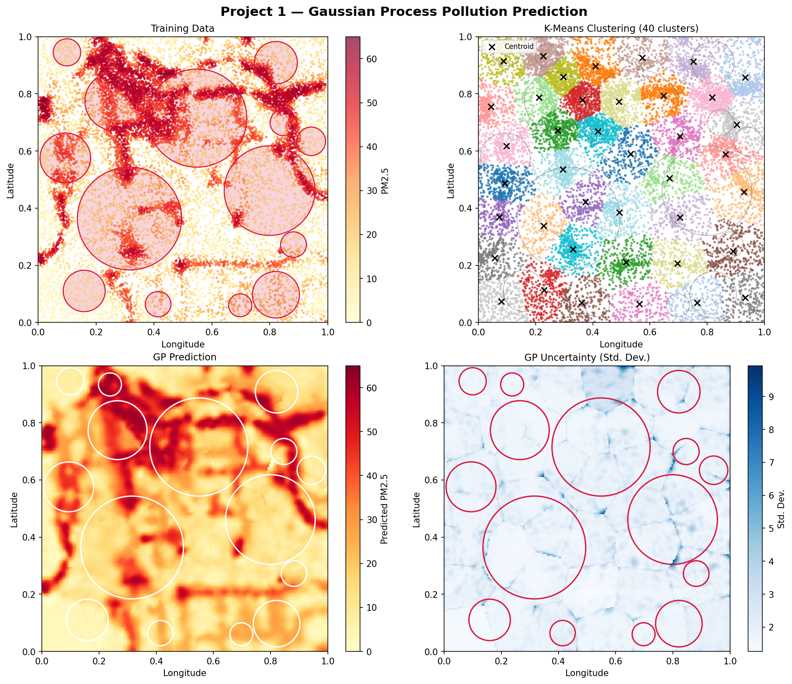
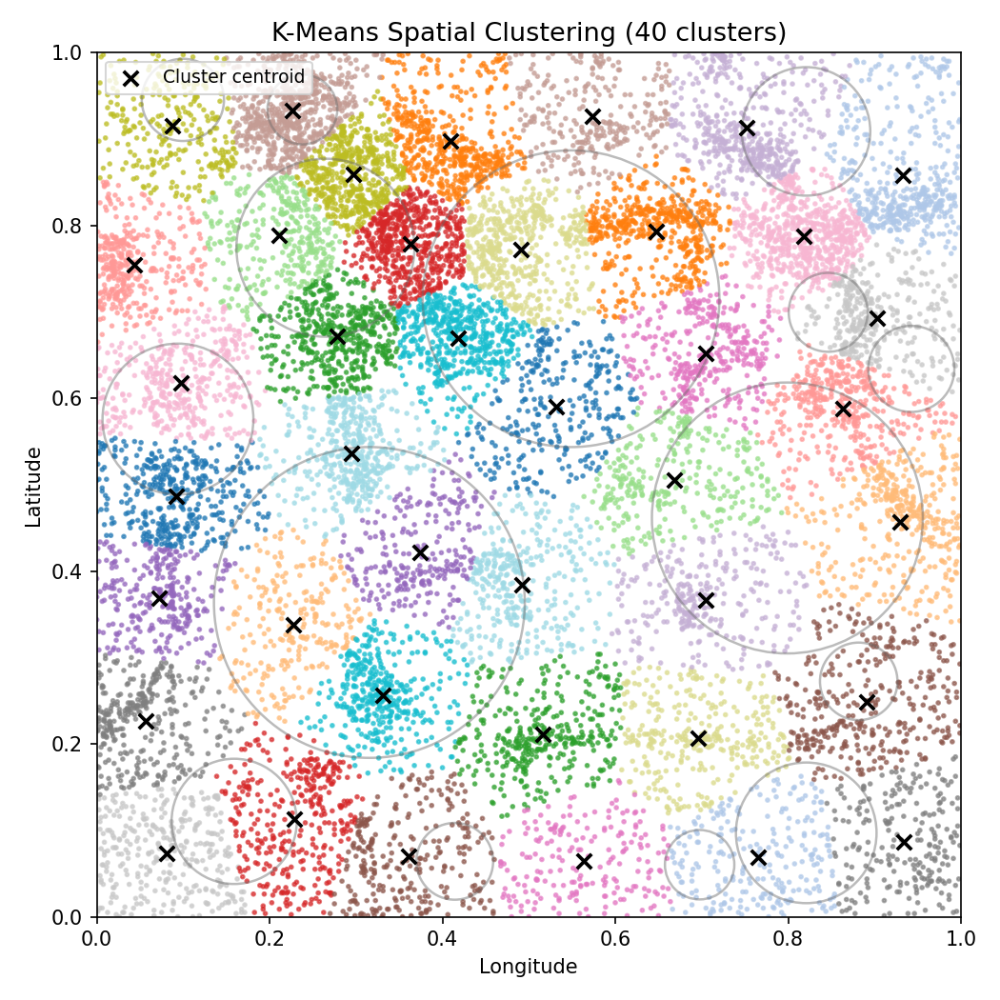
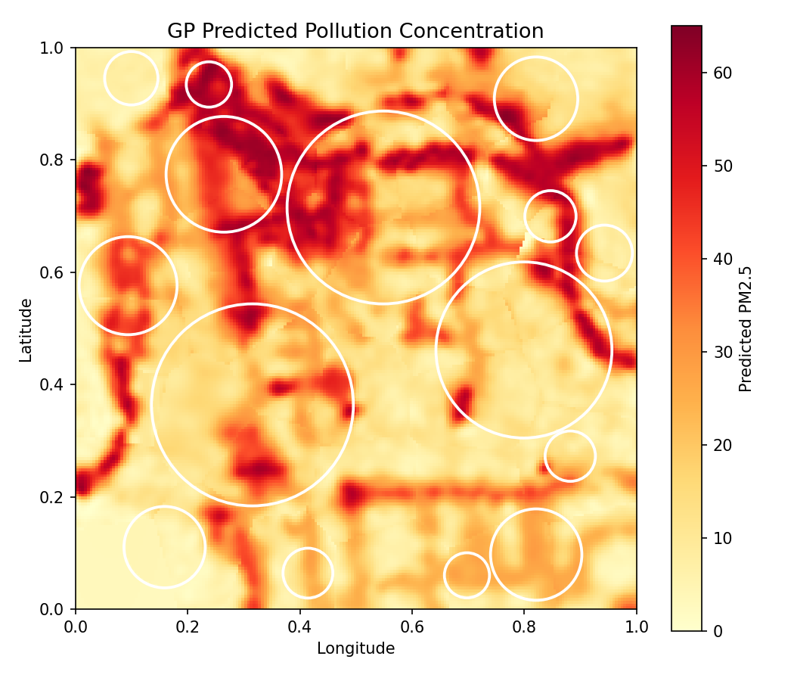
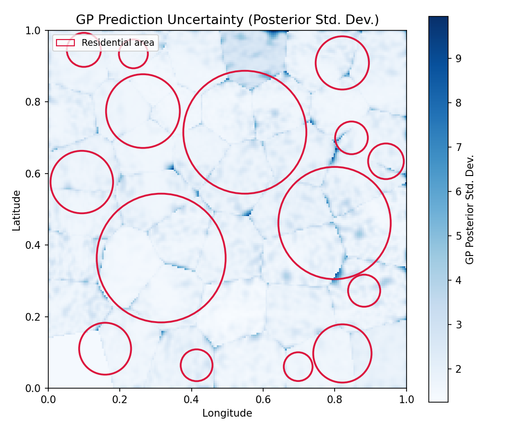

# Project 1 — Pollution Concentration Prediction

> **ETH Zurich · Probabilistic Artificial Intelligence · Team Volta**

Predict PM2.5 pollution levels across a city map using **Gaussian Process Regression**, while navigating an asymmetric cost function that makes under-predicting in residential areas 50× more costly than over-predicting.



---

## Problem

A city is monitored by ~15 000 air-quality sensors recording PM2.5 concentrations. Given sensor readings at known locations, the goal is to predict pollution at ~3 300 unobserved locations — a classic **spatial interpolation** problem.

The twist is a strongly asymmetric cost function. Missing a dangerous pollution spike in a residential neighbourhood is far worse than being slightly over-cautious:

$$\mathcal{L} = \frac{1}{N} \sum_{i=1}^{N} w_i \cdot (y_{\text{pred},i} - y_{\text{true},i})^2$$

| Area type | Weight $w_i$ | Consequence of under-prediction |
|---|---|---|
| Residential | **50** | Very high — health risk |
| Non-residential | 1 | Normal |

The model must therefore do more than minimise average error — it must be **risk-aware**.

---

## Approach

### 1. Kernel Design

A Matérn kernel (ν = 2.5) captures the smooth spatial correlation of pollution fields. A White kernel absorbs sensor noise, and a Constant kernel scales the overall signal magnitude:

```python
kernel = ConstantKernel(1.0) * Matern(length_scale=[0.1, 0.1], nu=2.5) \
       + WhiteKernel(noise_level=0.1)
```

All hyperparameters are optimised by maximising the log marginal likelihood during training.

---

### 2. Scalable Training via Local GPs

A full GP scales as O(n³) in training time. With ~15 000 points this is impractical. The solution: partition the map into **40 spatial clusters** with k-Means, then train one independent GP per cluster.

This reduces complexity from O(n³) to O(k · (n/k)³), a ~40× speedup in practice.



Each cluster contains ~380 points on average. Cluster boundaries align naturally with spatial regions, so local GPs still capture the relevant correlation structure.

---

### 3. Risk-Aware Prediction Strategy

GPs are unique in providing not just a prediction but a full posterior distribution: mean **μ** and standard deviation **σ** at every point. This uncertainty estimate is used directly to hedge against costly under-prediction:

$$\hat{y}_i = \begin{cases} \mu_i + c \cdot \sigma_i & \text{if residential} \\ \mu_i & \text{otherwise} \end{cases}$$

The safety coefficient **c = 1** shifts the prediction one standard deviation upward in residential zones — accepting a small over-prediction penalty to avoid the 50× under-prediction penalty.

---

## Results

| Metric | Value | Target |
|---|---|---|
| Baseline cost | 21.800 | — |
| **Our cost** | **4.549** | < 21.800 |
| Improvement | **79.1%** | — |

The GP prediction and its uncertainty map reveal the model's behaviour across the city:

<table>
  <tr>
    <td></td>
    <td></td>
  </tr>
  <tr>
    <td align="center"><em>Predicted PM2.5 concentration</em></td>
    <td align="center"><em>Posterior uncertainty (std. dev.) — spikes at cluster boundaries</em></td>
  </tr>
</table>

The uncertainty map exposes an honest limitation of the local-GP approach: uncertainty spikes at cluster boundaries where adjacent models diverge. This is a natural trade-off of the divide-and-conquer strategy.

---

## Files

| File | Description |
|---|---|
| `solution.py` | Main `Model` class — training, prediction, cost evaluation |
| `visualize.py` | Generates all plots and saves them to `plots/` |
| `requirements.txt` | Python dependencies |

---

## Usage

```bash
# Install dependencies
pip install -r requirements.txt

# Train and predict
python solution.py

# Generate all visualisations (model is cached after first run)
python visualize.py
```

The first run of `visualize.py` trains the model and caches it to `trained_model.joblib`. Subsequent runs load the cache and complete in seconds.
