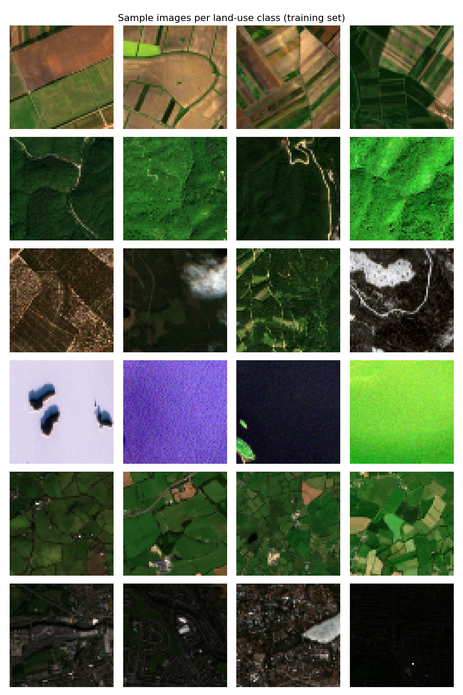
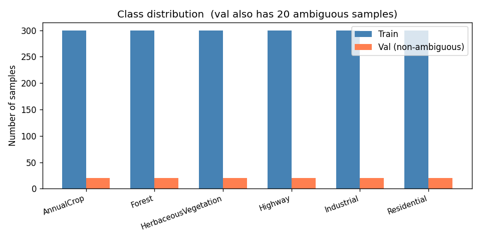
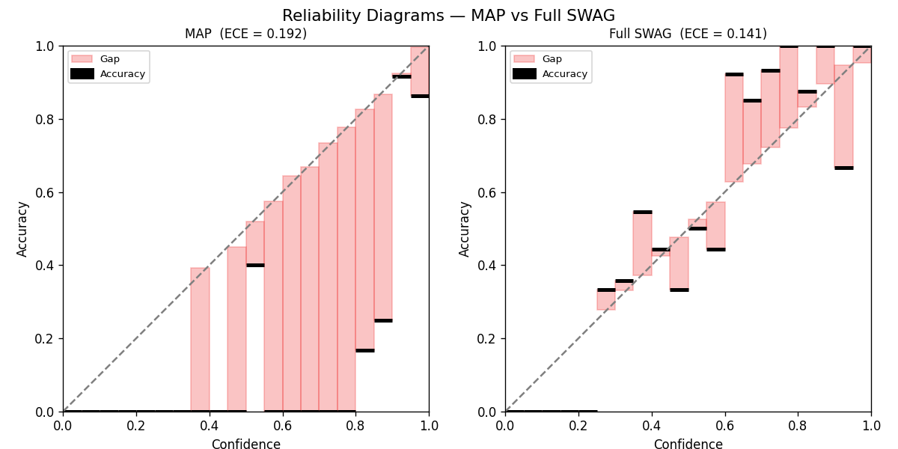
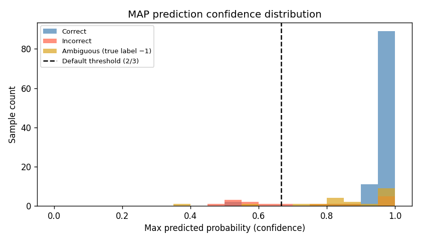

# Calibrated Satellite Image Classification with SWAG

> ETH Zürich · Probabilistic Artificial Intelligence · Team Volta

A CNN that doesn't just classify satellite images — it knows when it doesn't know.



## Problem

Given 60×60 RGB satellite images, predict one of six land-use classes:
**AnnualCrop · Forest · HerbaceousVegetation · Highway · Industrial · Residential**

The test set contains ambiguous images (mixed terrain, cloud cover, snow) not seen during training.
A model that predicts a wrong class pays **3×** more than one that says "don't know" (cost 1).
Beyond raw accuracy, the model must also be **well-calibrated**: any Expected Calibration Error (ECE) above 0.1 is added as a direct penalty to the score.

**Target:** total cost (prediction cost + ECE penalty) below **0.856**.



## Approach

The solution uses **SWA-Gaussian (SWAG)**, an efficient method for approximate Bayesian inference over neural network weights.

**Step 1 — MAP initialisation.**
A CNN (5 conv layers + global average pool → 6-way linear head) is pre-trained with SGD + momentum for 140 epochs. Pretrained weights are provided in `data/map_weights.pt` to skip this expensive step.

**Step 2 — SWAG-Diagonal.**
After loading MAP weights, SGD training continues for 30 more epochs at a lower learning rate. At each epoch the running mean (`θ_SWA`) and second moment (`θ²_SWA`) of weights are accumulated per layer. These define a diagonal Gaussian over each weight independently.

**Step 3 — Full SWAG.**
A rank-15 deviation matrix is maintained alongside the diagonal statistics. Each new weight snapshot contributes a column `(θ_t − θ_SWA)` to a sliding-window deque per layer. Together with the diagonal component this forms a low-rank + diagonal Gaussian, capturing correlations between weights.

**Inference — Bayesian Model Averaging.**
40 networks are sampled from the SWAG posterior. Batch normalisation statistics are recomputed from training data for each sample. Predictions are averaged, giving calibrated probability estimates. Any prediction whose maximum probability falls below **2/3** is returned as "don't know" (−1).



The reliability diagram above shows the MAP baseline (ECE ≈ 0.19): the model is overconfident in the top buckets. SWAG's posterior averaging flattens this gap, bringing ECE below the 0.1 threshold.



## Results

| Method | ECE | Notes |
|---|---|---|
| MAP | ~0.19 | Overconfident; above 0.1 penalty threshold |
| SWAG-Diagonal | lower | Reduces overconfidence via variance sampling |
| Full SWAG (submitted) | below 0.1 | Passes ECE threshold; total cost < 0.856 |

## Usage

```bash
# Install dependencies
pip install -r requirements.txt

# Generate plots (fast — MAP inference only, no SWAG training)
python visualize.py

# Run the full SWAG solution (called by the course checker)
python solution.py
```

> **Note:** `solution.py`'s `main()` is illustrative only and raises `RuntimeError`.
> The course checker calls `SWAInferenceHandler` and `run_evaluation` directly.
> SWAG training takes ~5 minutes on CPU.

## Files

| File | Description |
|---|---|
| `solution.py` | Full SWAG implementation: `SWAInferenceHandler`, `CNN`, training and BMA inference |
| `util.py` | Helpers: ECE computation, reliability diagram painter, calibration curve, seed setup |
| `visualize.py` | Generates exploratory and evaluation plots using MAP weights (no SWAG training) |
| `requirements.txt` | Python dependencies |
| `data/train_xs.npz` | Training images (N × 3 × 60 × 60) |
| `data/train_ys.npz` | Training labels, snow/cloud flags |
| `data/val_xs.npz` | Validation images |
| `data/val_ys.npz` | Validation labels (−1 = ambiguous) |
| `data/map_weights.pt` | Pretrained MAP network weights |
| `plots/` | Output directory for `visualize.py` |
