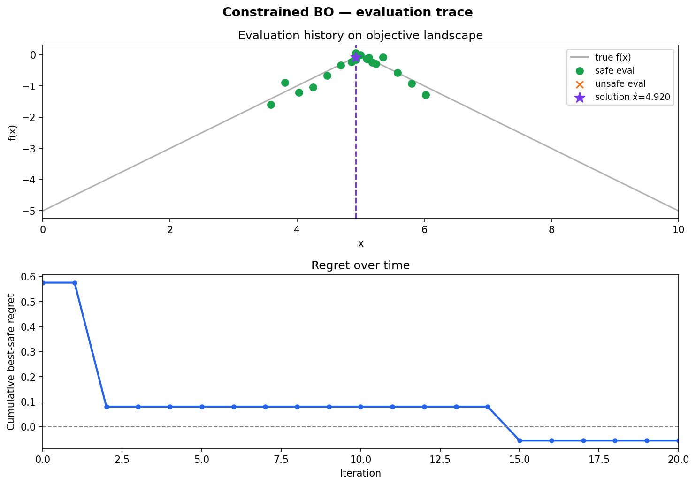
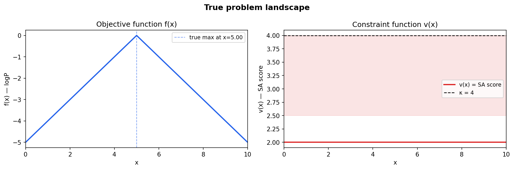
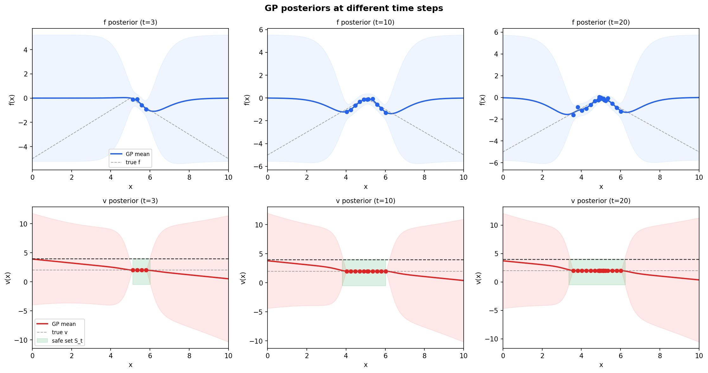
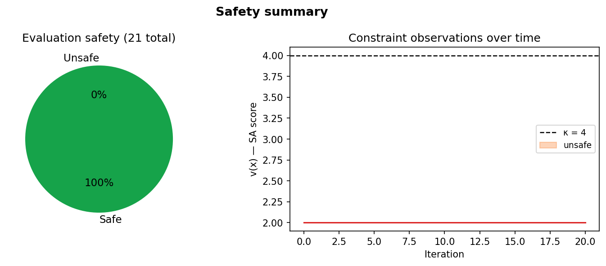

# Constrained Bayesian Optimization for Drug Discovery

> ETH Zürich · Probabilistic Artificial Intelligence · Team Volta (gguidarini, mdenegri, mmeciani)

Find the drug candidate that maximises bioavailability while staying synthesizable — using only noisy, expensive black-box measurements.



## Problem

A drug candidate is described by a single structural feature $x \in [0, 10]$.  Two properties are accessible only through noisy observations:

| Function | Meaning | Goal |
|---|---|---|
| $f(x)$ | logP (bioavailability proxy) | **Maximise** |
| $v(x)$ | SA score (synthetic accessibility) | Keep below $\kappa = 4$ |

The optimisation problem is:

$$\hat{x} = \arg\max_{x \in [0,10],\; v(x) < \kappa} f(x)$$

Both functions are unknown black boxes; each query costs a real experiment. Exceeding the safety threshold $v(x) \geq \kappa$ incurs a penalty, so the algorithm must balance exploration of $f$ with maintaining safety.



## Approach

The solution implements **SafeOpt-style constrained Bayesian optimisation** inside the `BO_algo` class.

**Gaussian Process models**

* $f$ is modelled with a Matérn-5/2 kernel (zero prior mean).
* $v$ is modelled with a DotProduct + Matérn-5/2 kernel (prior mean $\mu_v = 4 = \kappa$), so the GP naturally starts agnostic about safety.

**Confidence intervals**

At each step $t$ the algorithm maintains confidence sets $C_t^f$ and $C_t^v$ using the GP-UCB schedule:

$$\beta_t = 2 \log\!\left(\frac{2 N t^2 \pi^2}{6 \delta}\right)$$

The running intersection $\ell_t(x) = \max_{s \le t} (\mu_s - \sqrt{\beta_t}\,\sigma_s)$ and $u_t(x) = \min_{s \le t} (\mu_s + \sqrt{\beta_t}\,\sigma_s)$ tightens bounds monotonically.

**Safe set $S_t$**

A point $x'$ is added to $S_t$ if a known safe point $x_s \in S_t$ satisfies:

$$u_t^v(x_s) + L_v \|x_s - x'\| < \kappa - \epsilon$$

where $L_v = 7$ is a conservative Lipschitz estimate for $v$ and $\epsilon = 0.4$ is a safety margin.

**Acquisition target**

The algorithm selects the next query from the union of:
* **Expanders** $G_t$: safe points that can certifiably expand $S_t$ into unseen territory.
* **Potential maximisers** $M_t$: safe points where the upper confidence bound on $f$ exceeds the best observed lower bound: $u_t^f(x) \geq \max_{s \in S_t} \ell_t^f(s)$.

The acquisition function returns the upper confidence bound on $f$ for points in this valid set, steering the optimiser back toward the safe region otherwise.



## Results

On the toy problem (dummy $f$ and $v$), the algorithm converges to the safe optimum within 20 steps:

| Metric | Value |
|---|---|
| Proposed solution $\hat{x}$ | 4.92 |
| $f(\hat{x})$ | −0.08 |
| True optimum | 5.00 |
| Regret | ≈ 0.08 |

All evaluations in the toy run satisfy the safety constraint ($v = 2 < 4$ everywhere). On the graded benchmark (100 randomly generated tasks), the algorithm exceeds the baseline score of **0.785**.



## Usage

```bash
# Install dependencies
pip install -r requirements.txt

# Run the toy test harness (prints regret)
python solution.py

# Generate all plots (cached after first run)
python visualize.py
```

## Files

| File | Description |
|---|---|
| `solution.py` | `BO_algo` class: GP models, safe set construction, acquisition function, SafeOpt loop |
| `visualize.py` | Generates diagnostic plots of the GP posteriors, evaluation trace, and safety summary |
| `requirements.txt` | Python dependencies |
| `plots/` | Generated PNG figures (created by `visualize.py`) |
