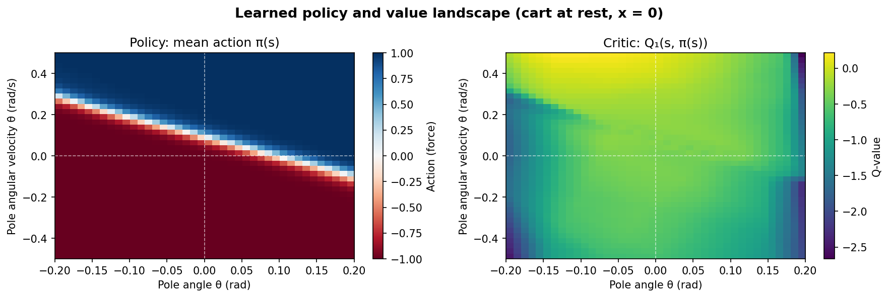
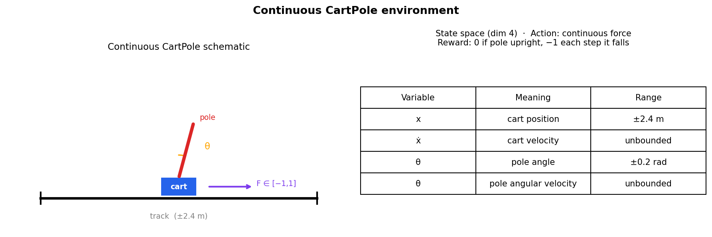
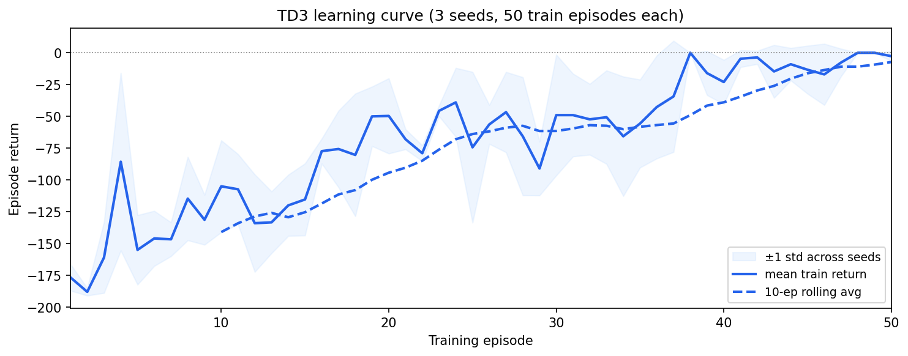

# Continuous CartPole via TD3

> ETH Zürich · Probabilistic Artificial Intelligence · Team Volta (gguidarini, mdenegri, mmeciani)

Balance a pole on a moving cart using continuous force control — trained entirely from reward signals with no model of the physics.



## Problem

A cart moves along a frictionless track. A pole is hinged to the cart and falls when the cart moves too far or the angle grows too large. The agent applies a continuous force $F \in [-1, 1]$ at each timestep and receives:

- **Reward 0** if the pole stays upright ($|x| < 2.4$, $|\theta| < 0.2$ rad)
- **Reward −1** at every step the pole is outside bounds

The episode runs for a fixed 200 steps (no early termination), so the optimal return is 0 and the worst is −200.

| State variable | Meaning |
|---|---|
| $x$ | cart position (m) |
| $\dot{x}$ | cart velocity |
| $\theta$ | pole angle (rad) |
| $\dot{\theta}$ | pole angular velocity |



## Approach

The solution implements **Twin Delayed Deep Deterministic Policy Gradients (TD3)**, a model-free off-policy actor-critic algorithm for continuous action spaces.

**Architecture**

- **Actor** $\pi_\phi$: a 3-layer MLP (256 units, ReLU) outputting a Gaussian distribution over actions (mean + log-std). Actions are squashed through $\tanh$ and rescaled to $[-1, 1]$.
- **Two Critics** $Q_{\theta_1}$, $Q_{\theta_2}$: independent 3-layer MLPs (256 units, ReLU) that take $(s, a)$ as input and output a scalar Q-value.

**TD3 key mechanisms**

| Mechanism | Implementation |
|---|---|
| Clipped double-Q | Target uses $\min(Q_{\theta_1'}, Q_{\theta_2'})$ to reduce overestimation |
| Target policy smoothing | Add clipped Gaussian noise $\mathcal{N}(0, 0.2)$, clipped at $\pm 0.5$, to the target action |
| Delayed policy update | Actor and target networks updated every 2 critic steps |
| Polyak averaging | $\theta' \leftarrow \tau\,\theta + (1-\tau)\,\theta'$ with $\tau = 0.005$ |

**Training protocol**

1. **Warmup** (10 episodes): random actions fill the replay buffer (capacity 50 000).
2. **Training** (50 episodes): after each environment step, one gradient update on a batch of 256 transitions.
3. **Test** (300 episodes, deterministic): mean action is used; no noise.



## Results

On the public evaluation (10 seeds, 50 training episodes per seed):

| Metric | Value |
|---|---|
| Mean test return | ≈ −3 to 0 |
| Best seeds | 0 (return = 0, pole never falls) |
| Worst seeds | occasional early failures |

The heatmaps above show that the learned policy correctly pushes right ($F > 0$) when the pole tilts right ($\theta > 0$) and vice versa — the expected stabilising behaviour. Q-values are highest (least negative) near the upright equilibrium.


## Usage

```bash
# Install dependencies
pip install -r requirements.txt

# Run the public evaluation (10 seeds, 50 train + 300 test episodes each)
python solution.py

# Generate all plots (training cached after first run)
python visualize.py
```

## Files

| File | Description |
|---|---|
| `solution.py` | `Agent` class: Actor/Critic networks, TD3 training loop, replay buffer interface |
| `utils.py` | `CustomCartpole` env, `ReplayBuffer`, `get_env`, `run_episode` helpers |
| `visualize.py` | Environment schematic, training curves, test-return distribution, policy/Q-value heatmaps |
| `requirements.txt` | Python dependencies |
| `plots/` | Generated PNG figures (created by `visualize.py`) |
